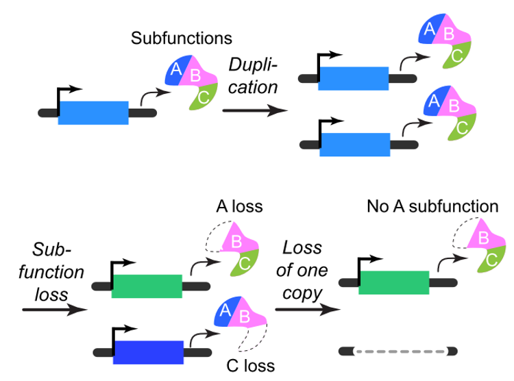
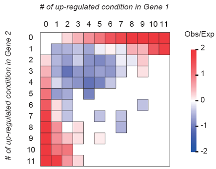
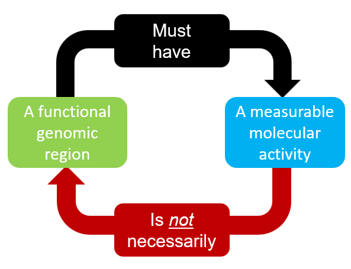
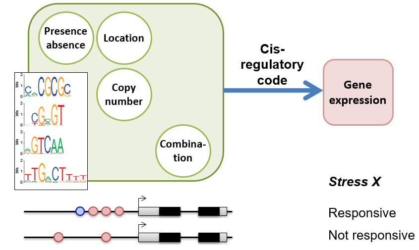
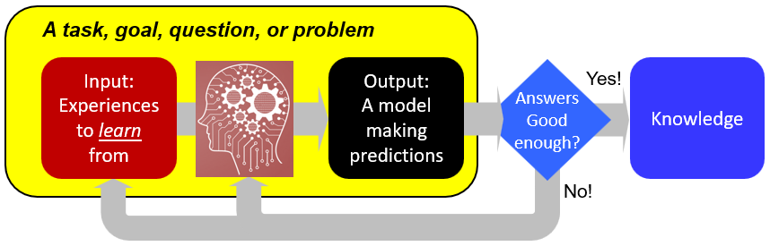

### Evolution of genome contents
 
How did genome evolve and what were the drivers? These questions are prompted by the observations that plants tend to have younger duplicate genes compared to other species, mainly due to frequent whole genome duplications. Example publications in this area:
- A Plant Physiology review discussing [evolution of duplicate genes in plants](https://www.ncbi.nlm.nih.gov/pubmed/27288366).
- An early PNAS paper documenting [the dramatic expansion of the receptor-like kinase family in plants](https://www.ncbi.nlm.nih.gov/pubmed/11526204) that kickstarted the PI's interests in evolution.
- A Genome Biology & Evolution paper on [the factors influencing gene family size variation across species](https://www.ncbi.nlm.nih.gov/pubmed/30239695).

### Stress response evolution
 
Under stressful environment, the expression of hundreds to thousands of genes changes at once. This response is essential for setting up proper physiological and developmental programs in plants so they can survive in adverse environment. Thus, proper response to stress is likely under significant amount of selective pressure. Example publications:
- A Plant Physiology paper detailing [molecular evidence of functional decay in a transcription factor regulating stress response](https://www.ncbi.nlm.nih.gov/pubmed/27522016).
- A Plant Cell paper on [the evolution of stress response between domesticated and wild tomato species](https://www.ncbi.nlm.nih.gov/pubmed/29743197).

### Signal vs. noise

With the adavanced in omics approaches, we can now measure biochemical activities from genomic regions with ease. Interestingly, it turns out that much of regions between known genes have measurable activities such as transcription. Is such activity noise or reflect some functionality of the region? Example publications:
- A Plant Physiology paper assessing [the pervasiveness of intergenic expresson in Arabidopsis](https://www.ncbi.nlm.nih.gov/pubmed/23132786).
- Two Molecular Biology & Evolution papers integrating multi-omics datasets with machine learning methods to identify functional region [in Arabidopsis thaliana](https://www.ncbi.nlm.nih.gov/pubmed/29554332) and [in human genomes](https://www.ncbi.nlm.nih.gov/pubmed/28398576).

### Regulatory logic & systems biology
 
We are interested in deciphering the cis-regulatory code, i.e., how cis-regulatory sequenecs work in concert with transcription factors to specify gene expression in conditionally, spatially, and temporally specific manner. Check out:
- Our PNAS paper analyzing stress expression data from Arabidopsis thaliana with systems biology approaches in [a comprehensive analysis of plant stress cis-regulatory code](https://www.ncbi.nlm.nih.gov/pubmed/21849619).
- Our PLoS Comp Biol paper discussing [the utility and limitation in using expression data for identifying functionally related genes](https://www.ncbi.nlm.nih.gov/pubmed/27935950).
- Our Plant Physiology papers detailing predictive models of [plant organ](https://www.ncbi.nlm.nih.gov/pubmed/28373393) and [cell-type](https://www.ncbi.nlm.nih.gov/pubmed/31551359) transcriptional response to stress.

### Machine learning for predictive biology
 
Biology has become a data-rich discipline with a rapid influx of heterogeneous data in a rapid pace. Novel ways in looking at these data have the potential to answer new questions, make high quality predictions of many biological phenomenons with machine learning models, and, from these predictive models, better understand the underlying mechanisms. Check out:
- Our study in PLoS Computational Biology on integrating sequence motif, chromatin state, and DNA structural information to [predict transcription factor binding site in yeast](https://www.ncbi.nlm.nih.gov/pubmed/26291518).
- Our PNAS paper combining a large number of heterogeneous characteristics to [predict whether an enzyme gene is involved in specialized metabolism or not](https://www.ncbi.nlm.nih.gov/pubmed/30674669).
- Our Plant Cell paper detailing [a model for predicting maize complex traits using genome and transcriptome variation data](https://www.ncbi.nlm.nih.gov/pubmed/31641024).
